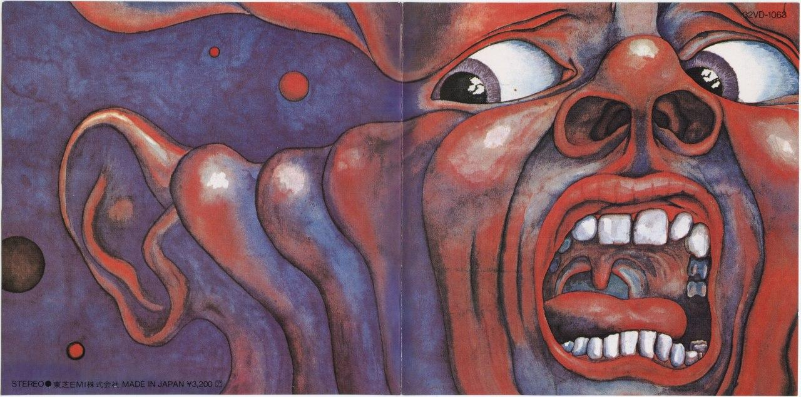

从 2019 年夏天开始，我用 [Jekyll](https://jekyllrb.com/) 搭建的博客已经运行一年有余。中间也经历过一次比较大的设计变动。到了今天， Jekyll 这种基于字符串模板的静态网站构建系统愈加让人沮丧。Jekyll 基于 YAML frontmatter 来传递数据，而这对于多个层级的 layout 嵌套显得十分笨拙；Jekyll 的模板语法只支持不多的语言特性，编写复杂的逻辑的时候语言的表达能力显得捉襟见肘，要想进行更多的静态页面改造只能借助插件（或者运行时的 JavaScript），但是开发插件所用的 ruby 语言并非我所熟悉的；Jekyll 编译需要长达几秒的时间，而且不能热重载，这常大大拖慢我调试模板的速度。

这些原因使得我一直寻求一个更加「现代化」的静态网站构建工具来重建我的博客。适逢 [Cloudflare 推出他们的静态网站托管服务](https://pages.cloudflare.com/)，本打算等内测的申请通过了再来重建；但是 Cloudflare 的内测申请迟迟没有动静，我有点按耐不住，于是便在前几天着手重建。到了今天，网站已经比较好地实现了基础的功能。

[Gatsby](https://gatsbyjs.com/) 是本次选择的框架。它基于 JavaScript 的生态，以 React 作为构建页面的工具。相比起 Jekyll，它是一个充分「现代化」的框架：

1. 开箱即用的现代前端工具链，Gatsby 会在幕后生成 webpack 和 babel 的配置并自动运行它们。
2. 能够 hot reload 的开发模式，修改前端代码一般能够在 1 秒之类反馈到页面上。
3. 只需要最小程度的配置就能够启用 prefetch，即当用户浏览某个页面的时候自动加载该页面上链接的其它页面的数据，从而在点击链接跳转的时候加载速度很快。
4. 有一套从后端到前端的模块化架构。从数据源（文件系统、wordPress 等）到数据（Markdown、元信息等）到页面（HTML, React），提供了一套可扩展的 API，将可定制性充分暴露出来。使用 GraphQL 作为数据的传递方式，同时提供了方便调试 GraphQL 的 web IDE。
5. 充分满足现代化特性的插件：从 RSS, sitemap, SEO 到 PWA, 静态搜索，自动图片压缩，均有插件提供便利的支持。

Gatsby 的[文档](https://www.gatsbyjs.com/docs/)非常友好，这里就不必重述其中的内容了。关于页面的设计这里倒是可以多提几句。可以看到，新版的网站主要使用深蓝色（`#11294d`）作为背景色，并且使用较亮的蓝色（`#74d7ff`）和橙色（`#d6a365`）用来作为主题色和辅助色。这个设计的想法主要来源于今年刚出版不久的 [The History of Jazz 第三版](https://www.amazon.com/History-Jazz-Ted-Gioia/dp/0190087218/)的封面。如果按照这个封面的设计，本来是应该用 `#000549` 作为背景色的，在我笔记本电脑的显示器上显示效果也不差，但是部署之后发现在其它色准更好的显示器上显示得更接近紫色，略显压抑。于是便稍微调整了一下色调和亮度。

Homepage 上的字样 “21st Century Schizoid Man" 来自 King Crimson 乐队在 1969 年的著名专辑 In The Court of the Crimson King 中的同名曲目。我试图让网站像这个标题一样具有某种神经分裂式的异质感，但是设计水平有限，并没有能够实现这样抽象的目标。

